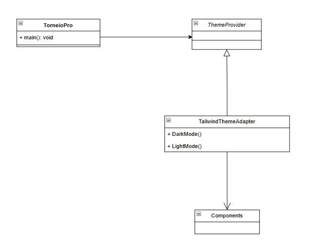
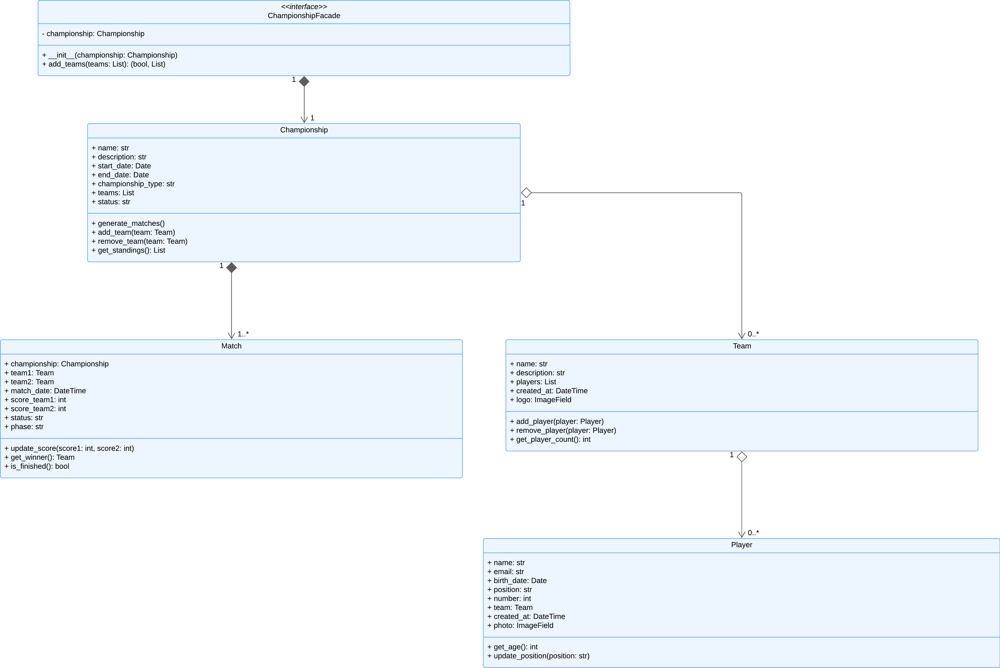

# 3.2. Módulo Padrões de Projeto GoFs Estruturais

## Introdução

Os Padrões de Projeto GoF Estruturais servem como guia no projeto, promovendo uma construção organizada, ao estruturar soluções reutilizáveis e claras para problemas recorrentes.

## Metodologia

O grupo foi dividido em três subgrupos, cada um responsável pela elaboração de um padrão criacional, estrutural e comportamental, totalizando três de cada tipo. Assim, o grupo se organizou para implementar um padrão de cada categoria do GoF.A produção dos padrões foi feita no software [draw.io](https://www.drawio.com/), que é uma ferramenta colaborativa online para criação de Diagramas.

## Adapter

### Uso

O Adapter tem como objetivo criar uma interface que simplifica o uso para o usuário, enquanto a complexidade da integração é delegada ao adaptador. Ele atua como um intermediário, permitindo que classes com interfaces incompatíveis trabalhem juntas.

### Diagrama-Front End

<center>

<font size="2"><p style="text-align: center">Figura 1: Adapter </p></font>




<font size="2"><p style="text-align: center">Autores: [Flávio Melo](https://github.com/flavioovatsug), [Oscar de Brito](https://github.com/OscarDeBrito),  [Christian](https://github.com/crstyhs), [Caio Sulz](https://github.com/CaioSulz), [Italo Bruno](https://github.com/ItaloBrunoM) e [Fabrício](https://github.com/FabricioDeQueiroz) </p></font>

<br>


</center>

### Implementação-Front End 

```typescript
export class TailwindThemeAdapter {
    private static darkMode = {
        transparent: "transparent",
        current: "currentColor",

        bodyBackground: "bg-body-background",
        bodyBackgroundTo: "bg-body-background-to",

        text: {
            primary: "text-primary-text",
            secondary: "text-secondary-text",
            detail: "text-primary-text-detail",
            accent: "text-accent-text",
            placeholder: "text-formPlaceholderText",
        },

        navbar: {
            base: "bg-navbar",
            hover: "bg-navbar-hover",
            primaryBtn: {
                base: "bg-navbar-primary-btn-base",
                hover: "bg-navbar-primary-btn-hover",
            },
            secondaryBtn: {
                base: "bg-navbar-secondary-btn-base",
                hover: "bg-navbar-secondary-btn-hover",
            },
        },

        slider: {
            active: "bg-slider-active",
            activeSearch: "bg-slider-active-search",
            liveBadge: "bg-slider-active-live-badge",
            future: "bg-slider-future",
            futureSearch: "bg-slider-future-search",
            occupation: "bg-slider-occupation",
        },

        card: {
            titleBg: "bg-card-title-bg",
            bg: "bg-card-bg",
        },

        modal: {
            entryTitleBg: "bg-modal-entry-title-bg",
            entryOccupation: "bg-modal-entry-occupation",
            entryViewBtn: {
                base: "bg-modal-entry-view-btn-base",
                hover: "bg-modal-entry-view-btn-hover",
            },
            entryBg: "bg-modal-entry-bg",
            entryInput: "bg-modal-entry-input",
        },

        sidebar: {
            bodyBg: "bg-sidebar-body-bg",
            titleBg: "bg-sidebar-title-bg",
            bg: "bg-sidebar-bg",
            baseBtn: {
                base: "bg-sidebar-base-btn-base",
                hover: "bg-sidebar-base-btn-hover",
            },
            activeBtn: {
                base: "bg-sidebar-active-btn-base",
                hover: "bg-sidebar-active-btn-hover",
            },
        },

        dashboardCard: {
            titleBg: "bg-dashboard-card-title-bg",
            bg: "bg-dashboard-card-bg",
            search: "bg-dashboard-card-search",
            btn: {
                base: "bg-dashboard-card-btn-base",
                hover: "hover:bg-dashboard-card-btn-hover",
            },
        },

        listItem: {
            bg: "bg-list-item-bg",
            btn: {
                base: "bg-list-item-btn-base",
                hover: "bg-list-item-btn-hover",
            },
            occupation: "bg-list-item-occupation",
            avatarBg: "bg-list-item-avatar-bg",
        },

        formModal: {
            bg: "bg-form-modal-bg",
            input: "bg-form-modal-input",
            checkInput: "bg-form-modal-check-input",
        },

        buttons: {
            primary: {
                base: "bg-primary-btn-base",
                hover: "bg-primary-btn-hover",
            },
            secondary: {
                base: "bg-secondary-btn-base",
                hover: "bg-secondary-btn-hover",
            },
            tertiary: {
                base: "bg-tertiary-btn-base",
                hover: "bg-tertiary-btn-hover",
            },
        },
    };

    private static lightMode = {
        transparent: "transparent",
        current: "currentColor",

        bodyBackground: "bg-white",
        bodyBackgroundTo: "bg-gray-100",

        text: {
            primary: "text-gray-900",
            secondary: "text-gray-700",
            detail: "text-gray-600",
            accent: "text-blue-600",
            placeholder: "placeholder-gray-400",
        },

        navbar: {
            base: "bg-gray-200",
            hover: "bg-gray-300",
            primaryBtn: {
                base: "bg-blue-500",
                hover: "bg-blue-600",
            },
            secondaryBtn: {
                base: "bg-gray-400",
                hover: "bg-gray-500",
            },
        },

        slider: {
            active: "bg-gray-300",
            activeSearch: "bg-gray-400",
            liveBadge: "bg-green-500",
            future: "bg-gray-200",
            futureSearch: "bg-gray-300",
            occupation: "bg-gray-100",
        },

        card: {
            titleBg: "bg-gray-200",
            bg: "bg-white",
        },

        modal: {
            entryTitleBg: "bg-gray-200",
            entryOccupation: "bg-gray-100",
            entryViewBtn: {
                base: "bg-blue-500",
                hover: "bg-blue-600",
            },
            entryBg: "bg-white",
            entryInput: "bg-gray-300",
        },

        sidebar: {
            bodyBg: "bg-gray-100",
            titleBg: "bg-gray-200",
            bg: "bg-white",
            baseBtn: {
                base: "bg-blue-500",
                hover: "bg-blue-600",
            },
            activeBtn: {
                base: "bg-blue-400",
                hover: "bg-blue-500",
            },
        },

        dashboardCard: {
            titleBg: "bg-gray-200",
            bg: "bg-white",
            search: "bg-gray-300",
            btn: {
                base: "bg-blue-500",
                hover: "bg-blue-600",
            },
        },

        listItem: {
            bg: "bg-gray-300",
            btn: {
                base: "bg-blue-500",
                hover: "bg-blue-600",
            },
            occupation: "bg-gray-200",
            avatarBg: "bg-gray-300",
        },

        formModal: {
            bg: "bg-white",
            input: "bg-gray-300",
            checkInput: "bg-blue-500",
        },

        buttons: {
            primary: {
                base: "bg-blue-500",
                hover: "bg-blue-600",
            },
            secondary: {
                base: "bg-green-500",
                hover: "bg-green-600",
            },
            tertiary: {
                base: "bg-red-500",
                hover: "bg-red-600",
            },
        },
    };

    private static currentTheme = "dark";

    static setTheme(theme: "light" | "dark") {
        this.currentTheme = theme;
    }

    static getColors() {
        return this.currentTheme === "dark" ? this.darkMode : this.lightMode;
    }
}
```

## Facade

### Uso
O padrão de projeto Facade (Fachada) tem como objetivo fornecer uma interface simplificada para um conjunto de interfaces ou funcionalidades mais complexas. Em aplicações que interagem com banco de dados, ele pode ser utilizado para esconder a complexidade de operações de consulta, persistência e outras lógicas de acesso a dados, oferecendo um ponto de acesso único a essas funcionalidades.

## Problema  
A interação direta com o banco de dados pode ser complexa e propensa a erros, dificultando a manutenção do código.  

## Solução  
A classe `ChampionshipFacade` foi desenvolvida para encapsular a complexidade do gerenciamento de conexões e execução de queries, fornecendo uma interface simplificada para operações no banco de dados.  

## Benefícios  
- **Simplificação**: Interface clara para operações no banco.  
- **Encapsulamento**: Esconde detalhes complexos.  
- **Segurança e Consistência**: Gerencia conexões de maneira confiável.  


### Diagrama-Back

<center>

<font size="2"><p style="text-align: center">Figura 1: Facade </p></font>




<font size="2"><p style="text-align: center">Autores: [Yan Werlley](https://github.com/YanWerlley), [Gustavo França](https://github.com/gustavofbs),  [Harry](https://github.com/harry-cmartin) </p></font>

<br>


</center>

### Implementação-Back

```python

    class ChampionshipFacade:
    def __init__(self, championship):
        self.championship = championship
    def add_teams(self, teams):
        """Simplifica o processo de adicionar times"""
        min_players = 11
        invalid_teams = []
        
        # Verifica jogadores
        for team in teams:
            player_count = team.players.count()
            if player_count < min_players:
                invalid_teams.append({
                    'team_id': team.id,
                    'name': team.name,
                    'current_players': player_count,
                    'required_players': min_players
                })
        
        if invalid_teams:
            return False, invalid_teams
            
        # Adiciona times
        self.championship.teams.add(*teams)
        
        # Gera partidas se necessário
        team_count = self.championship.teams.count()
        if (self.championship.championship_type == 'bracket' and team_count == 16) or \
           (self.championship.championship_type == 'points' and 10 <= team_count <= 20):
            self.championship.generate_matches()
            
        return True, None

```

```python

class ChampionshipViewSet(viewsets.ModelViewSet):

...

    def addteams(self, request):

    ...
        facade = ChampionshipFacade(championship)
        success, invalid_teams = facade.add_teams(teams)
    ...

```

## Bibliografia

> 1. **Gamma, E., Helm, R., Johnson, R., & Vlissides, J. (1994).**  
   *Design Patterns: Elements of Reusable Object-Oriented Software*. Addison-Wesley Professional.  
   **ISBN:** 978-0201633610 
> 2.  **Shalloway, A., & Trott, J. R. (2004).**  
   *Design Patterns Explained: A New Perspective on Object-Oriented Design*. Addison-Wesley Professional.  
   **ISBN:** 978-0321247148
> 3. **WIKIPEDIA.** *Design Patterns*. Disponível em: <https://en.wikipedia.org/wiki/Design_Patterns>. Acesso em: 05 jan. 2025.

## Histórico de Versão

|Versão|Data|Descrição|Autor|Revisor| Detalhes da revisão |
|:----:|----|---------|-----|:-------:|-----| 
| 1.0 | 05/01/2024 | Criação do arquivo |  [Christian](https://github.com/crstyhs) |  | |
| 1.1 | 05/01/2024 | Adição da implementação |  [Christian](https://github.com/crstyhs) |  | |
| 1.2 | 05/01/2024 | Adição da implementação Facade |  [Artur Jackson](https://github.com/artur-jack), [Ian Lucca](https://github.com/IanLucca12 ) e [Gabriel Esteves](https://github.com/GabrielMEsteves)|  | |
| 1.3 | 05/01/2024 | Adição de imagens |[Christian](https://github.com/crstyhs)  |  | |
| 1.4 | 05/01/2024 | Adição do Facade BackEnd |  [Yan Werlley](https://github.com/YanWerlley) |  | |

